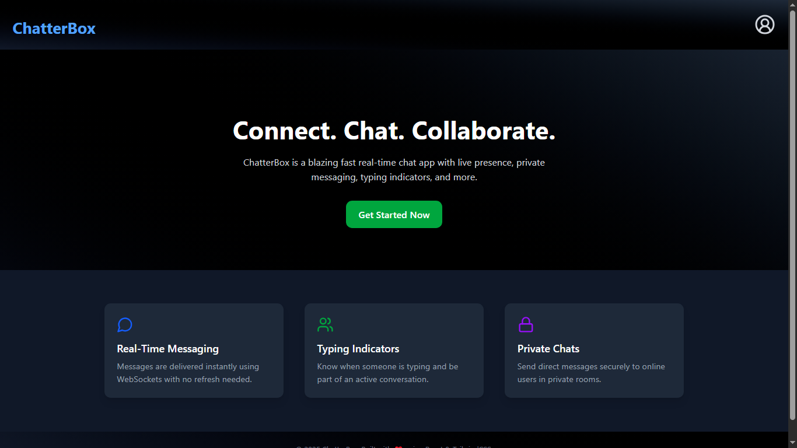
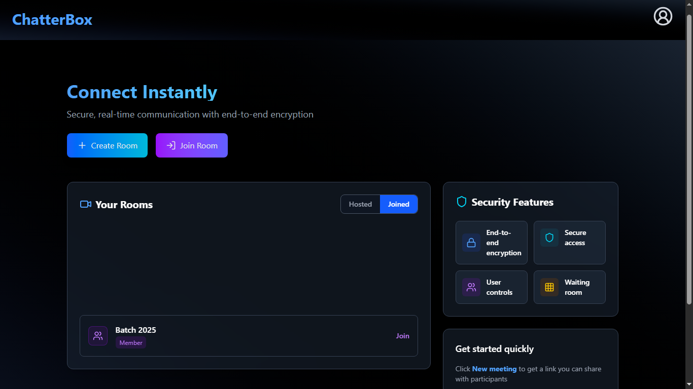
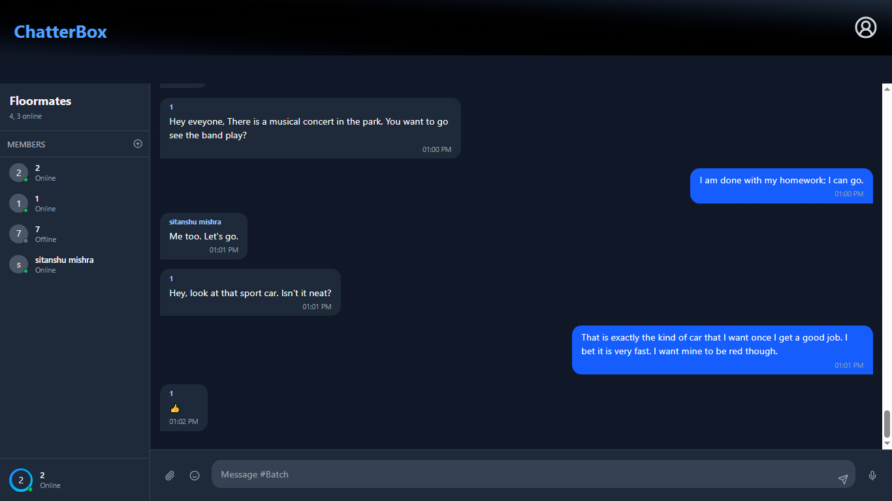

# 💬 ChatterBox

**ChatterBox** is a dynamic, real-time chat application that enables users to join or create chat rooms, fostering instant communication and collaboration. Designed with speed, security, and simplicity in mind, ChatterBox makes it easy to chat with others, track who's online, and stay connected.

> 🔒 Secure | ⚡ Fast | 🌐 Real-time

## 🚀 Description

ChatterBox is a blazing fast real-time chat app with live presence, private messaging, typing indicators, and more.

**Tagline:** _Connect. Chat. Collaborate._

---

## 🧠 Features

- 🔐 **Login / Signup** system with secure token authentication
- 🏠 **Create or Join Rooms** with a unique Room ID and password
- 💬 **Real-Time Messaging** using Socket.IO
- ✅ **Live Online/Offline Presence** of users
- ✍️ **Typing Indicators** to show who’s actively chatting
- 🔒 **Private Rooms** and direct messaging capabilities
- 📂 **Room Role Management** (host, member)
- 🌐 **End-to-End Encryption Simulation** for secure chat experience
- 🎛️ **User Controls & Waiting Room**

---

## 🖼️ Screenshots

### 🔹 Home Page


### 🔹 Room Interface


### 🔹 Chat Page


---

## 🛠️ Tech Stack

### Frontend:
- React.js
- TailwindCSS
- Redux
- Axios
- Websockets (Socket.IO Client)

### Backend:
- Node.js
- Express.js
- MongoDB (via Mongoose)
- Socket.IO (Server)

---

## ⚙️ Installation

### 📁 Clone the repository

```bash
git clone https://github.com/yourusername/chatterbox.git
cd chatterbox
